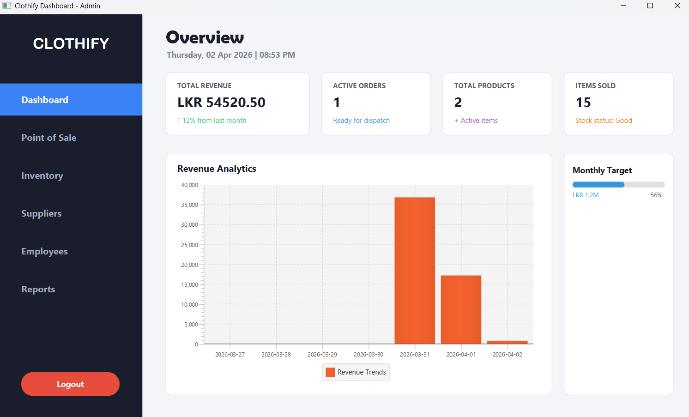
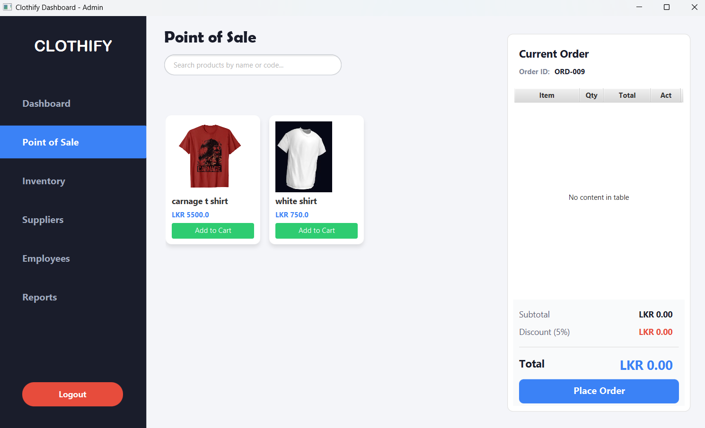
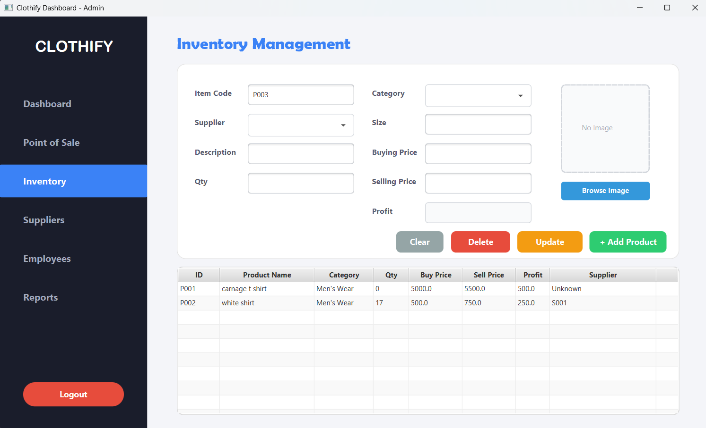
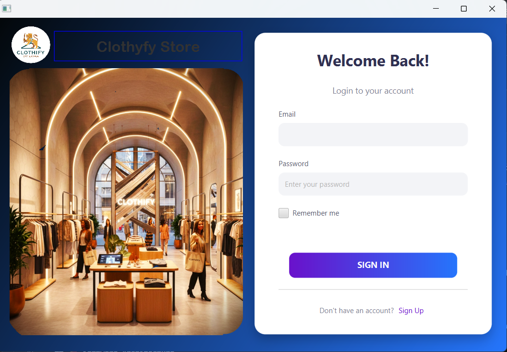

# 🛍️ Clothify - POS & Inventory Management System


Clothify is a modern, robust, and fully-featured Point of Sale (POS) and Inventory Management System designed for clothing retail stores. Built with Java and JavaFX, it strictly follows the **3-Tier Layered Architecture (MVC)** to ensure clean, maintainable, and scalable code.

## 🌟 Key Features

*   **🔐 Secure Authentication & RBAC:** Role-Based Access Control for Admins and Staff. All user passwords are encrypted using **SHA-256 Hashing** for maximum security.
*   **🛒 Advanced POS System:** Fast billing interface with dynamic cart management, auto-calculating totals, and automatic **PDF Bill Generation** (using iTextPDF).
*   **📦 Inventory Management:** Add, update, delete, and view products with image upload support. Real-time stock reduction upon order placement.
*   **👥 Employee & Supplier Management:** Efficiently manage staff and suppliers with strict input validation (Regex).
*   **📊 Dynamic Dashboard & Analytics:** Real-time visual representations of sales data, total revenue, and active orders using JavaFX Charts.
*   **🗄️ ORM Integration:** Seamless database operations using **Hibernate ORM**, ensuring zero raw SQL queries in the application layer.

## 📸 Screenshots

| Dashboard Overview | POS Terminal |
| :---: | :---: |
|  |  |

| Inventory Management | Login Screen |
| :---: | :---: |
|  |  |

## 🏗️ Software Architecture

This project strictly adheres to a **Layered Architecture**:
1.  **Presentation Layer (Controllers):** Handles JavaFX UI interactions and input validations.
2.  **Business Logic Layer (Services):** Contains all core business rules, ID generation, and calculations.
3.  **Data Access Layer (Repositories/DAOs):** Manages all database transactions using Hibernate Sessions.

## 🛠️ Technologies & Libraries Used

*   **Language:** Java (JDK 11 or higher)
*   **UI Framework:** JavaFX
*   **Database:** MySQL
*   **ORM Tool:** Hibernate Framework
*   **PDF Generation:** iTextPDF
*   **Security:** SHA-256 (java.security.MessageDigest)

## 🚀 Getting Started

### Prerequisites
*   Java Development Kit (JDK) installed.
*   MySQL Server installed and running.
*   IDE (IntelliJ IDEA / Eclipse) with JavaFX configured.

### Installation Steps
1.  **Clone the repository:**
    ```bash
    git clone [https://github.com/yourusername/clothify-pos.git](https://github.com/yourusername/clothify-pos.git)
    ```
2.  **Database Setup:**
    *   Create a new MySQL database named `clothify_db`.
    *   Update the `hibernate.cfg.xml` file with your MySQL username and password.
    *   Hibernate will automatically generate the required tables (`update` strategy).
3.  **Run the Application:**
    *   Execute the `Main.java` or `AppWrapper.java` class.
    *   **Default Admin Login:** 
        *   Email: `admin@clothify.admin.com` 
        *   Password: *(Create a user via the Sign-Up page first)*

## 👨‍💻 Author
**[UdaraDewshan]**  
*Final JavaFX Project*
